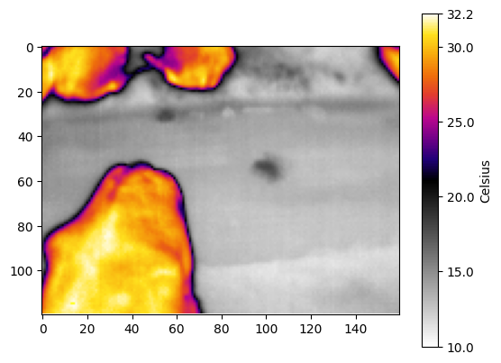

# tCam + Raspberry Pi


Tutorials and working code for running a **tCam-Mini** thermal camera from a **Raspberry Pi**:
continuous radiometric capture with ambient temperature/humidity, hourly archiving, cloud sync,
and offline conversion of the raw `.tjsn` files into thermal images and per-zone temperature CSVs.

Built for long-running, unattended deployments (originally dairy-cow thermal monitoring).



*A single `.tjsn` capture rendered by [`tjsn_jpg.py`](./Python%20Code/tjsn_jpg.py) in Celsius mode.
Three animals stand out clearly against the barn floor — the fixed 10.0–32.2 °C scale keeps that
contrast consistent across every frame in a run. Source file:
[`Display tjsn/raw_files/`](./Display%20tjsn/raw_files/).*

---

## Table of contents

1. [Overview](#overview)
2. [Hardware](#hardware)
3. [Repository structure](#repository-structure)
4. [Installation](#installation)
5. [Collecting data on the Pi](#collecting-data-on-the-pi)
6. [Running unattended](#running-unattended)
7. [File and folder naming](#file-and-folder-naming)
8. [The .tjsn format](#the-tjsn-format)
9. [Processing and visualization](#processing-and-visualization)
10. [Data management and sync](#data-management-and-sync)
11. [Tutorials](#tutorials)
12. [Known issues](#known-issues)
13. [Credits](#credits)
14. [License](#license)

---

## Overview

```
  tCam-Mini ──┐
              ├──▶  Raspberry Pi  ──▶  YYYYMMDD/HH.zip  ──▶  rclone  ──▶  OneDrive
  BME280   ───┘   (capture every 5 s)   of .tjsn files      (hourly)
                                                                 │
                                                                 ▼
                                                      Workstation (offline):
                                                      .tjsn ──▶ .png images
                                                            ──▶ zone_results.csv
```

Two halves:

- **On the Pi** — capture a radiometric frame every 5 seconds, read ambient T/RH from a BME280,
  write each frame into an hourly zip, and sync to cloud storage with `rclone`.
- **On a workstation** — batch-convert `.tjsn` files into colour-mapped PNGs, overlay the
  timestamp/temperature/humidity, and compute per-zone average temperatures into a CSV.

## Hardware

| Component | Notes |
|---|---|
| [tCam-Mini](https://github.com/danjulio/tCam) | FLIR Lepton 3.5, 160 × 120 radiometric |
| Raspberry Pi Zero 2 W | Any Pi works; scripts assume Raspberry Pi OS |
| BME280 sensor | Ambient temperature / humidity / pressure, over I²C |
| microSD card | Sized for local buffering before sync |

## Repository structure

```
Python Code/                       Scripts that run on the Pi and on a workstation
├── tcam_tjsn.py                   Capture only (superseded — see Known issues)
├── tcam_tjsn_TRH.py               Capture + BME280, loose files in YYYYMMDD/HH/
├── tcam_tjsn_TRH_SaveAsZip.py     Capture + BME280, into YYYYMMDD/HH.zip  ← recommended
├── Monitor_FolderStatus.py        Hourly rclone sync to cloud storage
├── disp_image.py                  Live preview from the camera (matplotlib)
├── tjsn_jpg.py                    Batch .tjsn ──▶ PNG with colorbar
├── display_info_on_image.py       Overlay date/temp/RH parsed from the filename
├── addtempRH.py                   Overlay temp/RH matched from an external data.csv
├── 5areaDetection.py              Per-zone average temperatures ──▶ zone_results.csv
└── tjsn 2 png save raw image/
    └── tjsn2raw_img.py            Batch .tjsn ──▶ raw 160×120 PNG + standalone colorbar

Display tjsn/                      Single-file inspection and sample data
├── Disp_tjsn.py                   Display one .tjsn file
├── display_tjsn.ipynb             Same, as a notebook
├── tjsn_jpg.py                    Batch converter (variant)
├── ironblack.py                   "ironblack" 256-entry colour palette (required)
└── raw_files/                     Sample .tjsn captures

Tutorial/                          Step-by-step setup guides (.docx)
```

> **Note:** `tjsn_jpg.py` and `ironblack.py` exist in more than one folder. `ironblack.py` is
> identical everywhere, but the `tjsn_jpg.py` copies have drifted apart. Treat
> [`Python Code/tjsn_jpg.py`](./Python%20Code/tjsn_jpg.py) as canonical.

## Installation

### 1. Raspberry Pi OS

Flash Raspberry Pi OS following the [official instructions](https://www.raspberrypi.com/software/), then:

```bash
sudo raspi-config          # Interface Options → enable SPI and UART
sudo nano /boot/firmware/cmdline.txt
```

Append `spidev.bufsiz=65536` to `cmdline.txt`.

> ⚠️ **Two things people get wrong here:**
> 1. `cmdline.txt` is a **single line** — append to the existing line, do not add a new one.
> 2. No spaces around the `=` sign.

Reboot afterwards.

### 2. Python dependencies

On the Pi (capture side):

```bash
pip install numpy matplotlib smbus2 RPi.bme280
```

On the workstation (processing side):

```bash
pip install numpy matplotlib pandas pillow opencv-python
```

The `tcam` module is **not** on PyPI — get it from the upstream project and keep it importable
alongside the capture scripts:

```bash
git clone https://github.com/danjulio/tCam.git
# use the python/ directory from that repo
```

`Monitor_FolderStatus.py` additionally needs [rclone](https://rclone.org/) on `PATH`, with a
remote already configured (`rclone config`).

### 3. Adjust the hard-coded paths

Several scripts have paths baked in. Edit them before the first run:

| Script | Constant | Default |
|---|---|---|
| `tcam_tjsn*.py` | `save_path` | `/home/lab/tcam/tjsn_collection/` |
| `tcam_tjsn*.py` | `interval` | `5` (seconds between frames) |
| `Monitor_FolderStatus.py` | `source_path` | `/home/lab/tcam/tjsn_collection` |
| `Monitor_FolderStatus.py` | `dest_path` | `/home/lab/clonesync` |
| `addtempRH.py` | CSV filename | `data.csv` in the working directory |
| `Disp_tjsn.py` | input file | `./raw_files/tcam_2024-11-25 03-06-17.tjsn` |

## Collecting data on the Pi

```bash
python "Python Code/tcam_tjsn_TRH_SaveAsZip.py"
```

Captures a frame every 5 seconds, reads the BME280, and appends the frame straight into the
current hour's zip. Writing into a zip keeps the SD card's file count and space use manageable
over multi-day runs — this is the recommended collector.

Alternatives:

| Script | Behaviour |
|---|---|
| `tcam_tjsn_TRH.py` | Same, but writes loose `.tjsn` files into `YYYYMMDD/HH/` |
| `disp_image.py` | Live preview instead of bulk capture — `python disp_image.py --ip 192.168.4.1 --pl CMRmap` |

All collectors stop cleanly on `Ctrl-C` and shut the camera down.

## Running unattended

**Survive an SSH disconnect** — `nohup` detaches the process from the terminal:

```bash
nohup python /home/lab/tcam/python/examples/tcam_tjsn_TRH_SaveAsZip.py &
```

**Start automatically after a reboot** — add a `@reboot` cron entry:

```bash
sudo crontab -e
```

Then add:

```
@reboot python /home/lab/tcam/python/examples/tcam_tjsn_TRH_SaveAsZip.py
@reboot python /home/lab/tcam/python/examples/Monitor_FolderStatus.py
```

## File and folder naming

The naming scheme is **load-bearing** — the processing scripts parse metadata back out of the
filenames, so don't rename files between capture and processing.

```
tjsn_collection/
└── 20250521/                                    YYYYMMDD
    ├── 13.zip                                   HH  (one archive per hour)
    │   └── 20250521_13-04-27_24-31C_58-92rh.tjsn
    └── 14.zip
```

```
20250521_13-04-27_24-31C_58-92rh.tjsn
│        │        │      └──────────  relative humidity, 58.92 %
│        │        └─────────────────  ambient temperature, 24.31 °C
│        └──────────────────────────  time, 13:04:27
└───────────────────────────────────  date, 2025-05-21
```

Decimal points are written as `-` because `.` is not safe in the middle of a filename here.
`display_info_on_image.py` reverses that substitution when it reads the values back.

## The .tjsn format

A `.tjsn` file is the tCam JSON frame written verbatim. The field this project cares about is
`radiometric`: a base64 string that decodes to **160 × 120 unsigned 16-bit** values, row-major,
in **hundredths of a Kelvin**.

```python
import array, base64, json
import numpy as np

with open(path) as f:
    frame = json.load(f)

raw = array.array('H', base64.b64decode(frame["radiometric"]))
celsius = np.array(raw, dtype=float).reshape(120, 160) / 100 - 273.15
fahrenheit = celsius * 9 / 5 + 32
```

## Processing and visualization

All processing scripts are interactive — they prompt for input and output folders, then process
every `.tjsn` in the input folder.

### `.tjsn` ──▶ PNG

```bash
python "Python Code/tjsn_jpg.py"
```

Prompts for an input folder, an output folder, and a unit (`C` or `F`). Renders each frame with
the **ironblack** palette and a labelled colorbar — see the [example above](#tcam--raspberry-pi).

Fixed display ranges (edit `vmin` / `vmax` in the script to change them):

| Unit | Range |
|---|---|
| °C | 10.0 – 32.2 |
| °F | 50 – 90 |

A fixed range means brightness is comparable across every frame in a run — but readings outside
it clip. Widen the range for hotter or colder scenes.

For the bare 160 × 120 image with no axes or padding, plus a standalone colorbar PNG:

```bash
python "Python Code/tjsn 2 png save raw image/tjsn2raw_img.py"
```

`ironblack.py` must sit next to whichever converter you run.

### Annotating images

```bash
python "Python Code/display_info_on_image.py"
```

Reads the date, temperature and humidity out of each PNG's filename and draws them onto the
image. Requires filenames in the format above.

If your T/RH readings live in a separate log instead, use:

```bash
python "Python Code/addtempRH.py"
```

which matches each image to a row of a `data.csv` with the headers
`Date, Time, Temperature, Humidity` (date as `M/D/YYYY`, time as `H:M:S`).

### Zone temperature analysis

```bash
python "Python Code/5areaDetection.py"
```

Splits each frame into five manually defined rectangles, averages the temperature (°F) in each,
and writes `zone_results.csv` **into the input folder**:

| Date | Time | Zone 1 | Zone 2 | Zone 3 | Zone 4 | Zone 5 |
|---|---|---|---|---|---|---|

Zone boundaries are the `w0…w4` / `h0…h3` arguments of `detect_cows()` — adjust them to match
your camera placement before trusting the output.

### Single-file inspection

For a quick look at one capture without running a batch:

```bash
python "Display tjsn/Disp_tjsn.py"          # edit the filename at the top
jupyter notebook "Display tjsn/display_tjsn.ipynb"
```

Sample captures live in [`Display tjsn/raw_files/`](./Display%20tjsn/raw_files/).

## Data management and sync

[`Monitor_FolderStatus.py`](./Python%20Code/Monitor_FolderStatus.py) runs alongside the collector
and pushes data off the Pi:

- Wakes at one minute past every hour (`00:01`, `01:01`, … `23:01`).
- Runs `rclone copy` on the current day's folder.
- On a date rollover it copies the **previous** day's folder one final time before moving on, so
  the last hour of a day is never left behind.

`rclone copy` only transfers new or changed files, so re-copying the same day each hour is cheap.

Run it detached, the same way as the collector:

```bash
nohup python /home/lab/tcam/python/examples/Monitor_FolderStatus.py &
```

### Planned

A daily workstation-side pass that walks each `YYYYMMDD/HH` folder and produces a PNG zip archive
plus a consolidated CSV (`DATE, TIME, TempC, RH%`) is designed but **not yet implemented** —
`tjsn_jpg.py` and `5areaDetection.py` currently cover these steps manually.

## Tutorials

Step-by-step guides in [`Tutorial/`](./Tutorial/):

| Document | Covers |
|---|---|
| `Tutorial-TCam-ResPi.docx` | Connecting the tCam to the Raspberry Pi |
| `Setting up Rpi Zero 2W - 241223.docx` | Initial Pi setup |
| `BME280 tutorial Rpi Zero 2W - 241221.docx` | Wiring and reading the BME280 |
| `DWH tutorial Rpi Zero W2 - 241128.docx` | Deployment walkthrough |
| `Backing up Rpi disk images - 250102.docx` | Imaging the SD card for backup |

## Known issues

- **`tcam_tjsn.py` is superseded.** It captures frames but records no ambient T/RH, writes loose
  files with no hourly folders, and names them `tcam_YYYY-MM-DD HH:MM:SS.tjsn` — a format the
  processing scripts do not parse, and whose colons are illegal in filenames on Windows and on
  most cloud-synced drives. Use `tcam_tjsn_TRH_SaveAsZip.py` instead; this one is kept for
  reference.
- **Font dependency.** `addtempRH.py` requires `arial.ttf` and has no fallback;
  `display_info_on_image.py` falls back to a default font. On Linux, install
  `ttf-mscorefonts-installer` or point the scripts at a font you have.
- **Divergent copies** of `tjsn_jpg.py` exist in three folders — see
  [Repository structure](#repository-structure).

## Credits

Built on [danjulio/tCam](https://github.com/danjulio/tCam) — the `tcam` Python module, the
`ironblack` palette, and the original `disp_image.py` example come from that project
(Apache-2.0). See its [python directory](https://github.com/danjulio/tCam/tree/main/python)
for the upstream API examples.

## License

Apache License 2.0 — see [LICENSE](./LICENSE).
